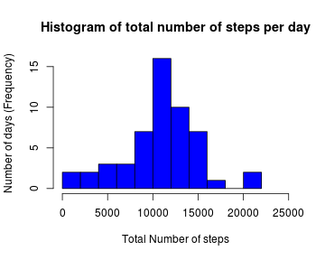
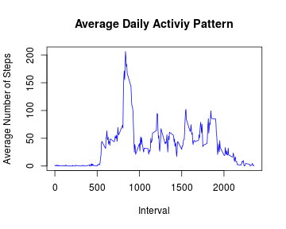
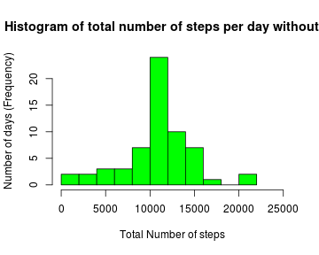
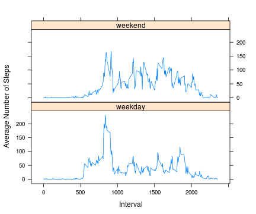

## Loading and preprocessing the data

1. Load the data (i.e. read.csv())
The requirements for this first step is that the zip archive is in the current working directory.
Data is unzipped and then read into a data frame.   


```r
unzip("activity.zip")
fulldata <- read.csv("activity.csv",header = T)
```

2. Process/transform the data (if necessary) into a format suitable for your analysis   
The date column is transformed from Factor to Date to ease later processing.   
The result is a 17568 observations dataframe with 3 columns.

```r
fulldata$date <- as.Date(fulldata$date,format="%Y-%m-%d")
str(fulldata)
```

```
## 'data.frame':	17568 obs. of  3 variables:
##  $ steps   : int  NA NA NA NA NA NA NA NA NA NA ...
##  $ date    : Date, format: "2012-10-01" "2012-10-01" ...
##  $ interval: int  0 5 10 15 20 25 30 35 40 45 ...
```


## What is mean total number of steps taken per day?

1. Calculate the total number of steps taken per day
The Data Table Package is loaded to analyze the data. All NAs are removed from the data and the the sum of steps per day is calculated.


```r
library("data.table")
```

```
## data.table 1.9.4  For help type: ?data.table
## *** NB: by=.EACHI is now explicit. See README to restore previous behaviour.
```

```r
filteredata <- data.table(fulldata[!is.na(fulldata$steps),])
result <- filteredata[,lapply(.SD,sum),by=date]
```
   
2. Make a histogram of the total number of steps taken each day, Iv've chosen a 10 interval histogram to better show the data distribution.   
   

```r
hist(result$steps,col = "blue",breaks = 10,main = "Histogram of total number of steps per day",xlab = "Total Number of steps", ylab = "Number of days (Frequency)",xlim =c(0,25000))
```

 
   
3. The mean and median number of steps taken per day are:   


```r
result_median<-median(result$steps)
result_mean<-mean(result$steps)
```
Median:   10765   
Mean;     10766.19

## What is the average daily activity pattern?

1. Make a time series plot (i.e. type = "l") of the 5-minute interval (x-axis) and the average number of steps taken, averaged across all days (y-axis)   
To calculate the average activity pattern I aggregate the data by interval calculating the mean number of steps. The average activity pattern is plotted against the intervals.   


```r
result2 <- filteredata[,lapply(.SD,mean),by=interval]
plot(x = result2$interval,y=result2$steps,type = "l", col="blue", main = "Average Daily Activiy Pattern", xlab = "Interval", ylab = "Average Number of Steps")
```

 

2. Which 5-minute interval, on average across all the days in the dataset, contains the maximum number of steps?   

The maximum value and the interval number with the maximun value of average daily steps are:
   

```r
     max(result2$steps)
```

```
## [1] 206.1698
```

```r
     result2$interval[result2$steps==max(result2$steps)]
```

```
## [1] 835
```

5-minute interval with maximum number of steps: 835   


## Imputing missing values
   
1. Calculate and report the total number of missing values in the dataset 
   

```r
     sum(is.na(fulldata$steps))
```

```
## [1] 2304
```
   
2. Devise a strategy for filling in all of the missing values in the dataset. 
I decided to substitute `NA` with the average of the 5 minute interval of all days.   
So I merged the full data frame togheter with the result from the previous steps representing the average of the five minute interval among all days.


```r
     newfulldata<- fulldata
     temp <- merge(newfulldata[is.na(newfulldata),],result2, by = "interval")
```

3. Create a new dataset that is equal to the original dataset but with the missing data filled in.  

Then the new dataset `newfulldata` is created substituting `NA` on the first column (steps)


```r
     newfulldata[is.na(newfulldata),][,1] <- temp[order(as.Date(temp$date.x,format="%Y-%m-%d")),][,4]
```

4. Make a histogram of the total number of steps taken each day and Calculate and report the mean and median total number of steps taken per day. Do these values differ from the estimates from the first part of the assignment? What is the impact of imputing missing data on the estimates of the total daily number of steps?   


```r
newfulldata <- data.table(newfulldata)
result3 <- newfulldata[,lapply(.SD,sum),by=date]
hist(result3$steps,breaks = 10, col = "green", main = "Histogram of total number of steps per day without NA",xlab = "Total Number of steps", ylab = "Number of days (Frequency)",,xlim =c(0,25000))
```

 

The mean is 10766.19 and doesn't change significantly from the calculated ones from the first step. That is because I used the averages to substitute the NA and thus the means remain the same. The median is 10766.19 and changes slightly because more observations have been added and that might alter slightly the median.


```r
median(result3$steps) - median(result$steps)
```

```
## [1] 1.188679
```

```r
mean(result3$steps) - mean(result$steps)
```

```
## [1] 0
```


## Are there differences in activity patterns between weekdays and weekends?
   
1. Create a new factor variable in the dataset with two levels – “weekday” and “weekend” indicating whether a given date is a weekday or weekend day.

I added a column with the weekday values, then I use string function "sub" to substitute weekdays with only two values ("weekday","weekend").   
Then I transform the column to factor.


```r
newfulldata2 <- as.data.frame(newfulldata)
newfulldata2$weekdays <- weekdays(newfulldata2$date,abbreviate = T)
newfulldata2$weekdays <- sub("Sun|Sat","weekend",newfulldata2$weekdays)
newfulldata2$weekdays <- sub("Mon|Tue|Wed|Thu|Fri","weekday",newfulldata2$weekdays)
newfulldata2$weekdays <- as.factor(newfulldata2$weekdays)
str(newfulldata2$weekdays)
```

```
##  Factor w/ 2 levels "weekday","weekend": 1 1 1 1 1 1 1 1 1 1 ...
```

2. Make a panel plot containing a time series plot (i.e. type = "l") of the 5-minute interval (x-axis) and the average number of steps taken, averaged across all weekday days or weekend days (y-axis). 

I transform the dataframe to a data table and create two subsets with the mean of the steps of the 5 minute intervals during weekdays and weekends.   


```r
newfulldata2 <- data.table(newfulldata2)
result_weekday <- newfulldata2[newfulldata2$weekdays=="weekday",lapply(.SD,mean),by=interval, .SDcols=c("steps")]
result_weekend <- newfulldata2[newfulldata2$weekdays=="weekend",lapply(.SD,mean),by=interval, .SDcols=c("steps")]
```
   
These two variables are then plotted on a panel plot.   
   

```r
library(lattice)
par(mfrow=c(2,1))
par(mar=c(4, 3, 3, 2))
plot(result_weekday$interval,result_weekday$steps,type = "l", col="blue", main = "Mean Steps by Interval for Weekday",xlab = "Intervals", ylab = "Average steps")
plot(result_weekend$interval,result_weekend$steps,type = "l", col="red", main = "Mean Steps by Interval for Weekends" ,xlab = "Intervals", ylab = "Average steps")
```

 

The plot and the following summary states that the average number of steps is higher on weekends rather than during weekdays. 


```r
summary(result_weekday$steps)
```

```
##    Min. 1st Qu.  Median    Mean 3rd Qu.    Max. 
##   0.000   2.247  25.800  35.610  50.850 230.400
```

```r
summary(result_weekend$steps)
```

```
##    Min. 1st Qu.  Median    Mean 3rd Qu.    Max. 
##   0.000   1.241  32.340  42.370  74.650 166.600
```
